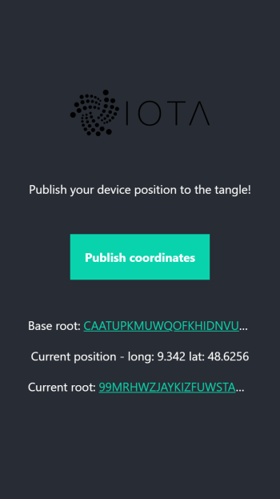

# IOTA Masked Authenticated Messaging Prototype

Send your current device location location to the IOTA tangle using Masked Authenticated Messaging (MAM)



Run the coordinates-publisher using:

```
npm install
npm run start
```